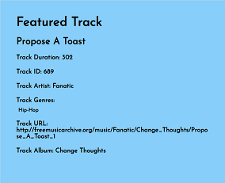
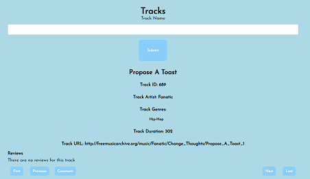

# Cool Feature Report


## Featured Tracks and Albums Bar with Links

<font size="3">

The cool feature that we have implemented in our app is the "Featured Tracks and Albums" bar. This allows anyone viewing the app to have a look at what tracks and albums are available in the app, by a randomly generated track and album available from the app. 


On all of the pages of the app, this sidebar is visible on the right hand side of the page. The features "Featured Track", which contains the track's title, ID, artist, genre(s), album, URL, and duration. Right below the featured track is a "Featured Album", which contains the album's title and ID, and right below is the album's first five track containing the same information as the featured tracks information above. If the album contains five or less tracks in its album, then it would just generate the five tracks. If the album contains more than five tracks, then it would just generate the first five tracks of the album and some ellipsis at the bottom to indicate that this album contains more than five track in its album. Due to how these tracks are generated, the order of track would be by their Track ID.

One thing about the "Featured Albums" we could have added is for the order of tracks in the album to be randomly assorted. This would allow tracks (if the album contained more than five tracks) that would not normally be visible be visible in the randomly sorted tracks in the album. But this was not implemented since firstly, it would be a little complicated for the implementation and randomness of the track ordering, and secondly, the already ordered track would allow users to be more curious on what tracks would not be visible on the "Featured Album's" track list, and click on a link on the album title to the album's page in the app; which we'll get onto later.

But before that, how are these tracks and albums generated. Well, these required some simple methods in the utilities blueprint which are:
```python
def get_random_track(repo):
    last_track_id = repo.get_last_track().track_id
    track = repo.get_track_by_id(random.randint(0, last_track_id))
    while track is None:
        track = repo.get_track_by_id(random.randint(0, last_track_id))
    return track

def get_random_album(repo):
    last_album_id = repo.get_last_album().album_id
    album = repo.get_album_by_id(random.randint(0, last_album_id))
    while album is None:
        album = repo.get_album_by_id(random.randint(0, last_album_id))
    return album
```
For both ways, it gets the ID of the last track or album, since that is the maximum possible ID available, then gets a track or album using a moethod from the `MemoryRepository` file by an ID that is randomly generated using the `random.randint()` method, which the start parameter being `0` and the end parameter being the maximum possible ID. However if you look at all of the tracks and albums in the repository, then there are some ID numbers that are never used, so there is a (good) chance that the randomly generated ID would be an ID of a track or album that doesn't exist; so to combat this issue, there is a while loop where if the randomly generated track or album is None (when the ID is invalid), then it would just keep generating a random track or album using the same method as above, until a valid track or album is generated. Then it would return that said track or album.

Now a cool thing about this feature is that there is a feature in the sidebar where by clicking on track's or album's title on the sidebar would link to the track's or album's respectively page. This would allow the user to easier access a track or album that interests them if there are not sure what to look for in the app.





This implemented by getting the randomly generated track's or album's ID and concatenating it into the track or album URL. `<a href="/browse_tracks?track_id={{random_track.track_id}}">`. This feature also works for the tracks in the randomly generated album as well.

</font>

